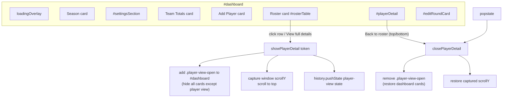

# Design Document: Admin Player Full-Screen View

## Overview

On the coach admin dashboard (`admin.html`), opening a player's details currently reveals a `#playerDetail` card at the bottom of a long, scrolling page. This feature relocates that presentation into a **full-screen, single-view experience within the same page**: when the coach opens a player (mobile "View full details" button or a desktop roster row), every other dashboard card is hidden, the page scrolls to the top, and only the player view is shown. "Back to roster" links at the top and bottom — plus the browser/gesture Back button — return the coach to the roster at the exact scroll position they left.

This is a **presentation-and-navigation change only**. There is no new HTML page, no backend/Apps Script change, and no session/auth change. The data layer, stats computation, and all existing admin mutations (edit/add/delete round, sex change, remove-from-season, delete-player) are preserved unchanged in behavior. The rounds list — today a wide `<table class="table-scroll">` that overflows on phones — gains a responsive card/stacked layout below the existing `640px` breakpoint, matching the recently added roster mobile-card pattern.

The implementation is a browser IIFE (`assets/js/admin.js`) with no build step and no DOM test runner, so navigation/layout behavior is verified by static analysis plus a documented manual verification procedure, while any factored-out pure helper (a rounds-row → card-fields mapper) is unit-testable in the existing dependency-free Node harness.

## Architecture

The dashboard is a single `#dashboard` container holding sibling cards. "Full-screen player view" is achieved purely by CSS class toggling on that container and its children — no DOM is moved, no route changes.



### View-state model

The dashboard has three visual states, all driven by classes on `#dashboard`:

| State | Class on `#dashboard` | Visible |
| --- | --- | --- |
| Loading | `dashboard-loading` | loading overlay only |
| Roster (default) | none | all cards except `#playerDetail`/`#editRoundCard` (those keep `.hidden`) |
| Player view | `player-view-open` | `#playerDetail` (and `#editRoundCard` when editing/adding) only |

`dashboard-loading` and `player-view-open` are independent and compose cleanly: the existing rule `#dashboard.dashboard-loading > *:not(.loading-overlay) { display:none !important }` already hides everything (including the player view) during a load, so a refresh mid-player-view shows the overlay, then returns to whichever state the JS sets afterward.

### Browser history integration

Opening the player view calls `history.pushState` once, adding a single history entry tagged as the player-view state. The on-page "Back to roster" links call `history.back()` (delegating to the same `popstate` path) so there is exactly one close path and no double-close. A `popstate` handler closes the view only when leaving the player-view entry. A guard flag prevents the programmatic `history.back()` and the resulting `popstate` from double-triggering restore logic.

## Components and Interfaces

### Component: Player-view navigation controller (in `admin.js`)

**Purpose**: Own the open/close transitions of the full-screen player view, including scroll capture/restore and browser-history wiring. Encapsulated as a small set of functions and module-level state inside the existing IIFE.

**Interface** (conceptual):
```javascript
// Module-level state
let currentPlayerToken = null;   // existing
let rosterScrollY = 0;           // NEW: window scrollY captured when opening
let playerViewOpen = false;      // NEW: whether the full-screen view is showing
let suppressPopstate = false;    // NEW: guard so back-link-driven history.back()
                                 //      doesn't run close logic twice

// Open the full-screen player view for a token (replaces old body of showPlayerDetail
// tail). Builds detail content (unchanged), then enters player-view state.
function showPlayerDetail(token) { /* ...build content...; enterPlayerView(); */ }

// Enter player-view visual + history state. Idempotent if already open (no extra pushState).
function enterPlayerView()  // captures rosterScrollY, adds .player-view-open,
                            // scrolls to top, pushState once, sets playerViewOpen=true

// Close the view and return to roster at the captured scroll position.
// `fromPopstate` = true when invoked by the popstate handler (do NOT call history.back()).
function closePlayerDetail(fromPopstate)

// popstate handler: if leaving player-view entry, closePlayerDetail(true).
function onPopState(event)
```

**Responsibilities**:
- Capture `window.scrollY` before hiding the roster.
- Toggle `#dashboard.player-view-open`.
- Manage exactly one history entry per open; wire `popstate`.
- Restore scroll on close (roster state) after layout is visible again.
- Never leave `admin.html`; Back from the roster state behaves normally.

### Component: Rounds renderer (in `showPlayerDetail`)

**Purpose**: Render the player's rounds into `#playerDetailRounds`. Behavior unchanged on desktop (the existing `<table>`); mobile presentation handled by CSS reading the same markup, augmented so a stacked card layout is possible without horizontal scroll.

**Interface**:
```javascript
// Pure helper (unit-testable): maps a computed round row to labeled display fields.
// Returns the same values the table cells show, as {label, value} pairs, so the
// mobile card layout and the desktop table stay in sync from one source.
function roundCardFields(row): Array<{ label: string, value: string }>
// row = { date, badgesHtml, course, tees, holesPlayed, score, diff, putts }
```

**Responsibilities**:
- Produce the per-round Date/Course/Tees/Holes/Score/Diff/Putts values (already computed via `Stats.*`).
- Keep Edit and Delete action buttons available in both layouts (same `data-round` attributes, same `.edit-round`/`.delete-round` handlers).

### Component: Full-screen player-view styles (in `styles.css`)

**Purpose**: Present `#playerDetail` (and `#editRoundCard`) as the only visible content when `#dashboard.player-view-open`, and render each round as a stacked card below `640px`.

**Responsibilities**:
- `#dashboard.player-view-open > *:not(#playerDetail):not(#editRoundCard)` → hidden.
- Reuse `:root` brand variables, `.card` visual system, and the existing `@media (max-width:640px)` breakpoint.
- Round cards scoped to a round-specific class so no other `.table-scroll` table is affected.

## Data Models

No persistent data model changes. One transient history-state object is introduced.

### History state entry
```javascript
// Pushed via history.pushState(state, '', location.href) when opening the view.
interface PlayerViewHistoryState {
  adminPlayerView: true   // marker so popstate can distinguish this entry
}
```
**Validation rules**:
- The marker MUST be a stable, namespaced key (`adminPlayerView`) to avoid colliding with any other `history.state`.
- No URL change is required (same `location.href`); the entry exists only to give Back something to pop.

### Round display row (transient, in-memory)
```javascript
interface RoundDisplayRow {
  date: string          // formatted date + optional badge HTML
  course: string
  tees: string
  holesPlayed: number
  score: number | '—'
  diff: string
  putts: number | '—'
  roundId: string       // for Edit/Delete data-round
}
```
**Validation rules**:
- All values are already derived from `Stats.*`; the mapper introduces no new computation, only relabeling for the card layout.

## Algorithmic Pseudocode

### Open player view

```pascal
PROCEDURE enterPlayerView()
  INPUT: (uses module state currentPlayerToken)
  OUTPUT: none (side effects: DOM classes, history, scroll)

  BEGIN
    IF playerViewOpen = true THEN
      RETURN          // already open; do not push another history entry
    END IF

    rosterScrollY ← window.scrollY          // capture exact roster position
    dashboard.classList.add("player-view-open")
    playerViewOpen ← true

    window.scrollTo(0, 0)                    // player view opens at the top

    history.pushState({ adminPlayerView: true }, "", location.href)
  END
END PROCEDURE
```

**Preconditions:** `#playerDetail` content has been populated for `currentPlayerToken`.
**Postconditions:** exactly one new history entry exists; only the player view (and edit card if open) is visible; window is scrolled to top; `rosterScrollY` holds the pre-open position.

### Close player view / Back to roster

```pascal
PROCEDURE closePlayerDetail(fromPopstate)
  INPUT: fromPopstate : boolean
  OUTPUT: none (side effects: DOM classes, history, scroll)

  BEGIN
    IF playerViewOpen = false THEN
      RETURN          // nothing to close (guards double-trigger)
    END IF

    dashboard.classList.remove("player-view-open")
    editRoundCard.classList.add("hidden")   // ensure edit card never lingers
    playerViewOpen ← false

    IF fromPopstate = false THEN
      // On-page Back link: pop our pushed entry. The resulting popstate is
      // ignored because playerViewOpen is already false (guard above).
      history.back()
    END IF

    // Restore roster scroll AFTER cards are visible again so the target
    // offset exists in the layout.
    window.scrollTo(0, rosterScrollY)
  END
END PROCEDURE
```

**Preconditions:** the player view is open.
**Postconditions:** dashboard is back in the roster state; the pushed history entry is consumed; window is restored to `rosterScrollY`; a subsequent Back behaves normally (no extra player-view entry remains).

### popstate handler

```pascal
PROCEDURE onPopState(event)
  INPUT: event (browser PopStateEvent)
  OUTPUT: none

  BEGIN
    IF playerViewOpen = true THEN
      // We were showing the player view and the user pressed Back/gesture.
      closePlayerDetail(fromPopstate ← true)   // do NOT call history.back() again
    END IF
    // If playerViewOpen is false, this popstate is either our own consumed
    // entry or normal roster navigation — do nothing (Back behaves normally).
  END
END PROCEDURE
```

**Loop invariants:** N/A (no loops). The `playerViewOpen` flag is the single source of truth that prevents the on-page Back link (which calls `history.back()`) and the resulting `popstate` from both running the restore.

### Post-mutation transitions

```pascal
PROCEDURE afterMutation(kind)
  // kind ∈ { deleteRound, editRound, addRound, saveSex,
  //          removeFromYear, deletePlayer }
  BEGIN
    AWAIT refresh()                 // reload data + re-render roster (existing)

    IF kind IN { deleteRound, editRound, addRound, saveSex } THEN
      // Player still exists → stay in / return to the player view.
      IF currentPlayerToken ≠ null THEN
        showPlayerDetail(currentPlayerToken)   // rebuild; enterPlayerView() is
                                               // idempotent, so no new history entry
      END IF
    ELSE   // removeFromYear OR deletePlayer
      currentPlayerToken ← null
      closePlayerDetail(fromPopstate ← false)  // return to roster (player is gone)
    END IF
  END
END PROCEDURE
```

**Preconditions:** the mutating API call succeeded and `refresh()` completed.
**Postconditions:** the coach remains on the player view for player-preserving actions, or is returned to the roster for actions that remove the player from the roster/system. No orphaned dashboard cards are visible behind the edit card.

### Edit/Add Round within the player view

The `#editRoundCard` remains a sibling of `#playerDetail`. When editing/adding, it is shown and `#playerDetail` is **hidden** so the editor is itself the full-screen sub-view (rather than appearing beneath the detail). Because `.player-view-open` hides every dashboard child except `#playerDetail` and `#editRoundCard`, no other dashboard cards leak behind the editor.

```pascal
PROCEDURE openRoundEditor(mode)          // mode ∈ { edit, add }
  BEGIN
    // ...populate the form (unchanged from current openEditRound/openAddRound)...
    playerDetail.classList.add("hidden")     // hide detail; editor takes over
    editRoundCard.classList.remove("hidden")
    window.scrollTo(0, 0)                     // editor opens at the top
    // playerViewOpen stays true; history entry unchanged (still one back = roster)
  END
END PROCEDURE
```

On editor submit/success the flow calls `showPlayerDetail(currentPlayerToken)`, which re-shows `#playerDetail`, hides `#editRoundCard`, and (idempotently) keeps the single history entry. Back from the editor therefore returns to the roster (documented, acceptable — the editor and detail share one history entry); a future enhancement could give the editor its own entry, but that is out of scope.

## Example Usage

```javascript
// Coach taps "View full details" on a mobile roster card:
showPlayerDetail('abc123');
//  -> builds #playerDetail content
//  -> enterPlayerView(): rosterScrollY = 1840; add .player-view-open;
//     scrollTo(0,0); pushState({adminPlayerView:true})
//  Only the player view is visible, scrolled to top.

// Coach taps "Back to roster" (top or bottom link):
closePlayerDetail(false);
//  -> remove .player-view-open; hide edit card; history.back();
//     scrollTo(0, 1840)  // exact card they tapped is back under the cursor

// Coach instead presses the phone's Back gesture:
//  popstate fires -> onPopState -> closePlayerDetail(true)
//  -> remove .player-view-open; scrollTo(0, 1840); (no extra history.back())

// Coach deletes a round while viewing the player:
//  deleteRound(...) -> refresh() -> showPlayerDetail(currentPlayerToken)
//  -> enterPlayerView() is a no-op (playerViewOpen already true); stays in view.

// Coach removes the player from the season:
//  removeFromYear(...) -> currentPlayerToken=null -> refresh()
//  -> closePlayerDetail(false) -> back on the roster.
```

## Correctness Properties

*A property is a characteristic or behavior that should hold true across all valid executions of a system — a formal statement about what the system should do.*

Because `admin.js` runs as a browser IIFE and the project's test harness is a dependency-free Node runner with no DOM (no jsdom/puppeteer, by constraint), only Property 1 is automatable in the harness. Properties 2 and 3 are genuine correctness invariants that depend on real DOM/history behavior; they are stated here for traceability and are verified by static analysis plus the documented manual verification procedure rather than by an automated property test.

### Property 1: Round display values are layout-independent (automatable)

*For all* round display rows, the labeled fields produced by `roundCardFields(row)` (the mobile card source) SHALL equal the corresponding Date, Course, Tees, Holes, Score, Diff, and Putts values rendered by the desktop table for the same row, including the `null → '—'` treatment for Score and Putts.

**Validates: Requirements 5.4**

### Property 2: Open/close preserves roster scroll position (invariant — manual/static)

*For all* roster scroll positions, opening the Player_View and then closing it by any single Back action (top link, bottom link, or browser/gesture Back) SHALL restore the window to the exact scroll position captured at open time.

**Validates: Requirements 3.1, 3.2, 2.3, 4.2**

### Property 3: Each Back action closes the view exactly once and leaves no extra history (invariant — manual/static)

*For all* opens of the Player_View, exactly one history entry is added; and *for any* single Back action while the view is open, the close-and-restore behavior runs exactly once (never zero or twice), re-showing the Player_View after a player-preserving mutation adds no additional history entry, and Back while already on the Roster_View leaves normal browser navigation unaffected.

**Validates: Requirements 4.1, 4.3, 4.4, 4.5, 8.6**

## Error Handling

### Scenario: Unknown/invalid token passed to `showPlayerDetail`
**Condition**: `token` has no matching player (e.g. stale card after refresh).
**Response**: Return early (existing `if (!player) return;`) without entering the player view or pushing history.
**Recovery**: Dashboard remains in its current state; no orphaned history entry.

### Scenario: Mutation API call fails
**Condition**: A round/sex/remove/delete request rejects.
**Response**: Existing `try/catch` shows `alert(err.message)` (or inline message for the editor); the view state is not changed by the failed action.
**Recovery**: Coach stays on the current view and can retry.

### Scenario: Refresh occurs while the player view is open
**Condition**: A player-preserving mutation triggers `refresh()`.
**Response**: `dashboard-loading` hides all children (including the player view) behind the overlay during the load; afterward the JS re-shows the correct state via `showPlayerDetail`.
**Recovery**: `player-view-open` and `dashboard-loading` compose without conflict; final state is deterministic.

### Scenario: Back pressed while on the roster (not the player view)
**Condition**: `playerViewOpen = false`.
**Response**: `popstate` handler does nothing; normal browser navigation proceeds (leaving `admin.html` as it would without this feature).
**Recovery**: No loop; no trapped history.

## Testing Strategy

### Unit Testing Approach
- Test the pure `roundCardFields(row)` mapper in the existing dependency-free Node harness: given a computed round row, it returns the expected labeled fields (Date, Course, Tees, Holes, Score, Diff, Putts) with the same values the table shows. Include edge cases: `score`/`putts` null → `'—'`, tournament/summary badge handling, empty-safe strings.
- No new test framework; follow the pattern of `assets/js/admin-logic.test.js` and `assets/js/roster-preservation.test.js` (plain Node, no jsdom/puppeteer).

### Property-Based Testing Approach
- The single pure helper is amenable to a property test (field count / label stability / value passthrough), but the harness is example-based; a lightweight loop over generated rows can assert the passthrough invariant without adding a PBT library.
- **Property Test Library**: none introduced (constraint). Properties below are verified via static analysis + the manual procedure, except the pure-mapper passthrough which can be checked with generated examples in the Node harness.

### Manual Verification Procedure (navigation/layout — no DOM runner)
Documented steps to run in a browser (both a desktop width and a ≤640px width / device emulation):
1. Desktop: click a roster row → only the player view shows, page at top; other cards hidden. Click "Back to roster" (top) → roster restored at prior scroll; repeat with bottom link.
2. Mobile width: tap "View full details" → player view only; rounds render as stacked cards (no horizontal scroll); Edit and Delete visible per round.
3. Mobile: use the Back gesture → returns to roster at the exact prior scroll position; does not leave `admin.html`.
4. Scroll the roster far down, open a player, Back → confirm the same card/row is under the viewport.
5. Open editor (Add Round / Edit) → editor is the only visible content (no cards behind); submit → returns to player view; Back → returns to roster.
6. Mutations: delete round & save sex → stay in player view; Remove from Season & Delete Player → land on roster.
7. Confirm desktop rounds table is unchanged (still a table, horizontally scrollable if needed).

### Static Analysis Checks
- Verify exactly one `pushState` per open and exactly one consuming path (guard flag prevents double close).
- Verify `.player-view-open` selector excludes `#playerDetail` and `#editRoundCard` only.
- Verify the mobile rounds CSS is scoped (does not match other `.table-scroll` tables).

## Performance Considerations

Negligible: class toggles, one scroll capture/restore, and one history entry per open. No extra network calls; rendering reuses existing computed data.

## Security Considerations

No change to auth/session handling. No new data exposure. All round values continue to pass through the existing `escapeHtml` sanitization when injected into markup (the mobile card layout MUST use the same escaping as the current table cells).

## Dependencies

- No new runtime or dev dependencies.
- Uses existing browser APIs: `history.pushState`, `popstate`, `window.scrollY`/`scrollTo`, `classList`.
- Reuses existing modules: `Stats.*`, `UI.withBusy`, `escapeHtml`, and existing `els.*` element references.
- Files touched: `admin.html` (add top/bottom Back links, optional round-card container hooks), `assets/js/admin.js` (navigation controller + mapper + transition wiring), `assets/css/styles.css` (player-view + responsive rounds styles).
