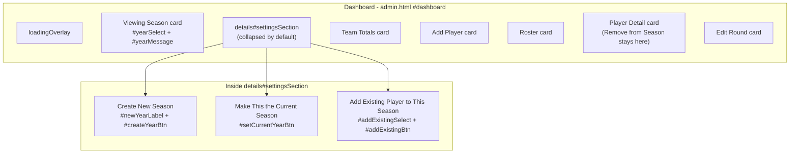

# Design Document

## Overview

This feature reorganizes the Coach Admin dashboard (`admin.html` + `assets/js/admin.js`)
so that the **rarely-changed** season-management controls (Create New Season,
Make This the Current Season, Add Existing Player to This Season) move into a
collapsible, collapsed-by-default **Settings** section, while the
**frequently-changed** Viewing Season selector stays on the main dashboard. It
also adds cross-session persistence of the last-viewed season via
`localStorage`.

The change is **primarily frontend, with exactly one backend change**. No Google
Apps Script backend action is added, renamed, or removed, but the existing
`createYear` action is extended: instead of always carrying the full previous
current-season roster forward, it now accepts a list of selected player tokens
and rosters only those players onto the new season (an empty/omitted list yields
an empty roster). This is the only backend edit, and it requires **exactly one
Apps Script redeploy**. The other actions `setCurrentYear`, `addPlayerToYear`,
`removePlayerFromYear`, and `adminData` are reused exactly as they are today.
There are no new dependencies, no build step, and no framework — the work stays
within the existing vanilla-JS module IIFE, the single stylesheet, and the
static HTML.

The design is deliberately small: it is a relocation of existing markup, a thin
new state-resolution helper for season selection, a player-import checklist for
season creation, a small `createYear_` change on the backend, the corresponding
`els` references, and a guarded `localStorage` read/write pair. Every existing
behavior (scoping to the viewing season, the empty-seasons safeguard, the round
editor, Remove from Season on player detail) is preserved.

### Goals

- Collapse season-management controls behind a titled, collapsed-by-default
  Settings disclosure. (Req 1)
- Keep the Viewing Season selector, with its `(Current)` marker, on the main
  dashboard. (Req 2)
- Remember the last-viewed season across reloads, degrading gracefully when
  storage is unavailable. (Req 3)
- Relocate Make Current and Add Existing Player behavior unchanged, and relocate
  Create Season while extending it with a player-import checklist. (Reqs 4, 5, 6)
- Let the Admin choose which players from the previous current season's roster to
  import onto a newly created season (none pre-checked, zero-selected allowed,
  empty candidate list yields an empty-roster season), replacing the automatic
  full-roster carry-forward. (Req 4)
- Leave Remove from Season on player detail untouched. (Req 7)
- Change only the `createYear` backend action (extend its request to carry the
  selected tokens); leave every other backend contract untouched. (Req 8)

### Non-Goals

- No **new, renamed, or removed** backend action. Modifying the existing
  `createYear` action is in scope; adding/renaming/removing actions is not.
- Exactly one Apps Script redeploy (to apply the `createYear` change) is **in
  scope**; no further redeploys are needed.
- No change to Team Totals, Roster, player-detail stats, or the round editor
  logic beyond the season-selection wiring.
- No generic settings framework beyond a container that could hold future
  settings; this feature scopes Settings content to season management only.

## Architecture

The application is a static site. `admin.html` provides the markup; a set of
plain `<script>` files loaded in order provide behavior. `admin.js` is a single
IIFE that closes over module-private state (`data`, `selectedYearId`,
`currentPlayerToken`, ...) and an `els` map of cached DOM references. Shared
helpers live in sibling globals (`Api`, `UI`, `Stats`, `HoleTable`).

This feature touches the following files:

| File | Change |
| --- | --- |
| `admin.html` | Relocate season controls into a new `<details id="settingsSection">`; keep the Viewing Season selector in its own card. Add an Import_Candidates checklist container (`#importPlayersList`) inside the Create New Season block. |
| `assets/css/styles.css` | Add `.settings` disclosure styles built from existing brand variables. |
| `assets/js/admin.js` | Add a pure `resolveViewingYearId()` helper, a guarded `Store` wrapper for `localStorage`, write-on-change / write-on-create hooks, and read-on-load precedence in `populateYearSelect()`. Move the `setCurrentYear` / `addExisting` `els` and handlers unchanged. Change the `createYearBtn` handler to render the import checklist and send `playerTokens` in the `createYear` payload; add an `els.importPlayersList` reference plus `renderImportCandidates()` / `collectImportSelection()`. |
| `assets/js/admin-logic.js` | Add a pure `importCandidatesFrom(players, playerYears, currentYearId)` helper (name-sorted previous-current roster) so the checklist input is property-testable. |
| `apps-script/Years.gs` | Extend `createYear_(label, playerTokens)` to roster only the provided tokens onto the new season (via `addPlayerToYear_`) instead of unconditionally carrying the full previous roster forward. Remove the now-unused `copyPlayerYearRoster_` call. |
| `apps-script/Code.gs` | Pass `body.playerTokens` through: `createYear_(body.label, body.playerTokens)`. No new/renamed action. |

The `apps-script/*` edits require **one** coordinated Apps Script redeploy
(Req 8.4); the frontend and backend must ship together (see the backward-compat
note below).

### Layout after the change



### Collapse mechanism: native `<details>`/`<summary>` (chosen)

Two options were considered:

1. **Native `<details>`/`<summary>`** — a semantic HTML disclosure widget.
2. **A `<button>` + a `.hidden`-toggling class** driven by JS, mirroring the
   existing `classList.toggle('hidden', ...)` pattern used elsewhere.

**Decision: use native `<details>`/`<summary>`.** Rationale:

- **Zero JS for the core toggle.** Expand/collapse, keyboard operability
  (Enter/Space), focus handling, and the ARIA `expanded` semantics are provided
  by the browser. This keeps the diff tiny and matches the project's
  no-framework, minimal-JS ethos. It also satisfies Req 1.3/1.4's "within 300ms"
  trivially — the toggle is synchronous.
- **Built-in visible indicator.** The default disclosure triangle already
  reflects open/closed state (Req 1.2), and we restyle it with a CSS marker for
  brand consistency.
- **Collapsed-by-default is declarative** — simply omit the `open` attribute
  (Req 1.1). No load-time JS needed to force the initial state.
- **Accessibility for free.** `<summary>` is a button-role element in the
  accessibility tree with correct expanded/collapsed state, avoiding the manual
  `aria-expanded` bookkeeping the button+class approach would require.

The button+class approach was rejected because it reintroduces work the platform
already does correctly (keyboard, ARIA, focus) for no benefit, and would add an
extra `els` entry and handler purely to reimplement `<details>`.

The one consideration: the controls inside are populated/refreshed even while
collapsed (e.g. `populateAddExistingSelect()` runs during `refresh()`). Because
`<details>` only *hides* collapsed content (it stays in the DOM), all existing
`getElementById` lookups and innerHTML writes continue to work unchanged whether
the section is open or closed. This is exactly why the relocation is low-risk.

## Components and Interfaces

### 1. HTML relocation (`admin.html`)

**Viewing Season card (stays on dashboard, simplified).** The existing "Season"
card currently holds four controls. It is reduced to just the viewing selector
and its message region:

```html
<div class="card">
  <h2>Season</h2>
  <div id="yearMessage"></div>
  <div class="field" style="margin-bottom:0">
    <label for="yearSelect">Viewing Season</label>
    <select id="yearSelect"></select>
  </div>
</div>
```

- `#yearSelect` and `#yearMessage` keep their IDs and location on the main
  dashboard (Req 2.1). The `(Current)` marker in option text is produced by
  existing `populateYearSelect()` logic and is unchanged (Req 2.4).
- The empty-seasons actionable message still renders into `#yearMessage`
  (Req 8.4).

**New Settings section (houses the relocated controls).** Inserted after the
Viewing Season card (or wherever fits the visual flow; placement after the
selector keeps season concerns adjacent):

```html
<details id="settingsSection" class="card settings">
  <summary class="settings-summary">Settings</summary>

  <div class="settings-body">
    <!-- Make current: shown only when viewing season isn't current (Req 5.2/5.3) -->
    <div class="field" style="margin-bottom:0.75rem">
      <button type="button" id="setCurrentYearBtn" class="secondary">Make This the Current Season</button>
    </div>

    <!-- Create new season (Req 4) -->
    <div class="field-row" style="align-items:end; margin-bottom:0.5rem">
      <div class="field" style="margin-bottom:0">
        <label for="newYearLabel">New Season Label</label>
        <input type="text" id="newYearLabel" placeholder="e.g. 2027-2028" maxlength="100">
      </div>
      <div class="field" style="margin-bottom:0">
        <button type="button" id="createYearBtn">Create New Season</button>
      </div>
    </div>

    <!-- Import players from the previous current season (Req 4.2, 4.3, 4.8) -->
    <div class="field" style="margin-bottom:0.75rem">
      <label>Import players from the current season</label>
      <p class="muted">Pick which players to carry onto the new season. Nothing is
        selected by default, and you can create a season with no players.</p>
      <div id="importPlayersList"></div>
    </div>

    <!-- Add existing player to viewing season (Req 6) -->
    <h3>Add Existing Player to This Season</h3>
    <p class="muted">For a returning player who isn't rostered for the season you're viewing (e.g. they were removed by mistake, or sat out a season).</p>
    <div id="addExistingMessage"></div>
    <div class="field-row" style="align-items:end">
      <div class="field" style="margin-bottom:0">
        <label for="addExistingSelect">Player</label>
        <select id="addExistingSelect"></select>
      </div>
      <div class="field" style="margin-bottom:0">
        <button type="button" id="addExistingBtn">Add to Season</button>
      </div>
    </div>
  </div>
</details>
```

Relocation summary:

| Element | Old location | New location |
| --- | --- | --- |
| `#yearSelect`, `#yearMessage` | "Season" card | **Stays** in Viewing Season card |
| `#setCurrentYearBtn` | "Season" card | Moves into `#settingsSection` |
| `#newYearLabel`, `#createYearBtn` | "Season" card | Moves into `#settingsSection` |
| `#importPlayersList` (import checklist) | *(new)* | Added inside the Create New Season block in `#settingsSection` |
| `#addExistingSelect`, `#addExistingBtn`, `#addExistingMessage` | standalone "Add Existing Player" card | Moves into `#settingsSection` |
| `#removeFromYearBtn` | player detail card | **Unchanged** (Req 7) |

Note the `maxlength="100"` added to `#newYearLabel` to reflect Req 4.1's
1–100-character bound (the trim/empty check in JS handles the lower bound).

The `#importPlayersList` region is the Import_Candidates checklist (Req 4.2). It
is populated by `renderImportCandidates()` (see the JS section) from the roster
of the season currently marked current — one checkbox row per candidate, each
carrying the player token as its `value` and **all unchecked** on every render.
When there are no candidates (no previous current season, or that season has an
empty roster), it renders a single "no players to import" note instead of
checkboxes, and season creation is still allowed and produces an empty roster
(Req 4.3). Example rendered shape:

```html
<!-- one row per Import_Candidate, all unchecked (Req 4.2) -->
<label class="import-row">
  <input type="checkbox" class="import-player" value="{playerToken}"> {Player Name}
</label>
<!-- ...or, when there are no candidates (Req 4.3): -->
<p class="muted">No players to import.</p>
```

### 1a. Backend: `createYear` accepts selected tokens (`apps-script`)

This is the single backend change. Today `createYear_(label)` validates and
dedupes the label, captures `previousCurrent`, calls `setAllYearsNotCurrent_()`,
appends the new Years row, and then **unconditionally** carries the entire
previous current-season roster forward via
`copyPlayerYearRoster_(previousCurrent.YearID, yearId)`. That full carry-forward
is replaced by rostering only the tokens the Admin selected.

**`Code.gs` — pass the token list through.** The `doPost` `'createYear'` case
still calls `requireSession_(body.session)` and still returns
`jsonOut_(...)`; it just forwards the new field:

```js
case 'createYear':
  requireSession_(body.session);
  return jsonOut_(createYear_(body.label, body.playerTokens));
```

**`Years.gs` — `createYear_(label, playerTokens)`.** Everything up to and
including appending the new Years row is unchanged (label trim + required check,
duplicate-label check, `previousCurrent` capture is no longer needed for the
carry-forward but is harmless if left; `setAllYearsNotCurrent_()`; append the new
row with `IsCurrent: true`). The one behavioral change is the roster step:

```js
function createYear_(label, playerTokens) {
  label = (label || '').toString().trim();
  if (!label) throw new Error('Year label is required.');
  var existing = listYears_();
  if (existing.some(function (y) { return y.Label === label; })) {
    throw new Error('A year called "' + label + '" already exists.');
  }

  setAllYearsNotCurrent_();
  var yearId = Utilities.getUuid();
  appendObject_(SHEET_YEARS, {
    YearID: yearId,
    Label: label,
    IsCurrent: true,
    CreatedAt: new Date()
  });

  // Roster ONLY the selected players onto the new season (Req 4.8). An empty or
  // omitted list rosters nobody -> empty-roster season (Req 4.3). addPlayerToYear_
  // is idempotent, so duplicate tokens in the request are harmless.
  var tokens = Array.isArray(playerTokens) ? playerTokens : [];
  tokens.forEach(function (token) {
    if (token) addPlayerToYear_(token, yearId);
  });

  return { yearId: yearId, label: label };
}
```

- **Selected-subset rostering (Req 4.8):** the new season's roster contains
  exactly the provided tokens. `addPlayerToYear_` already no-ops on duplicates,
  so it is safe against repeated tokens.
- **Empty/omitted list (Req 4.3):** when `playerTokens` is `[]` or missing, no
  `PlayerYears` rows are created and the season starts empty.
- **No full carry-forward:** the previous `if (previousCurrent) copyPlayerYearRoster_(...)`
  line is **removed**. There is deliberately **no fallback** to the old
  full-carry behavior, because that would contradict Req 4.8 / Req 8.1.

**Backward-compatibility note (accepted behavior change).** Because the fallback
is intentionally dropped, an *older deployed frontend* that calls `createYear`
without `playerTokens` would now create an **empty roster** instead of carrying
the previous roster forward. This is an accepted behavior change: the frontend
and backend must be deployed **together** (the single coordinated redeploy of
Req 8.4). This is why the redeploy is required and why the token list is not
treated as optional-with-legacy-semantics.

**Dead code cleanup.** `copyPlayerYearRoster_` in `PlayerYears.gs` was called
**only** from `createYear_`. Once the carry-forward line is removed it has no
remaining callers, so it becomes dead code. Recommendation: **remove
`copyPlayerYearRoster_`** to avoid leaving an unused helper that implies the old
behavior still exists. (`addPlayerToYear_` and `isPlayerInYear_` stay — they are
used elsewhere and by the new roster loop.)

### 2. CSS (`assets/css/styles.css`)

`<details class="card settings">` reuses the existing `.card` shell (border,
radius, padding, spacing) so the section already matches surrounding cards. Only
the summary affix and marker need new rules, all built from existing brand
variables:

```css
/* Collapsible admin Settings disclosure. Reuses .card for the shell; these
   rules only style the summary row and its open/closed indicator. */
.settings > summary.settings-summary {
  cursor: pointer;
  list-style: none;              /* hide default marker; we draw our own */
  font-family: var(--font-heading);
  font-size: 1.05rem;
  color: var(--navy);
  display: flex;
  align-items: center;
  gap: 0.5rem;
}
.settings > summary.settings-summary::-webkit-details-marker { display: none; }

/* Brand-consistent expand/collapse indicator (rotates when open). */
.settings > summary.settings-summary::before {
  content: "\25B8";              /* right-pointing triangle when collapsed */
  color: var(--gold);
  transition: transform 0.15s ease;
  display: inline-block;
}
.settings[open] > summary.settings-summary::before {
  transform: rotate(90deg);      /* points down when expanded */
}

.settings .settings-body { margin-top: 0.9rem; }
```

- The gold triangle matches the `--gold` brand accent already used on the header
  border and `.success` left-border.
- Rotating the marker gives the visible open/closed indicator (Req 1.2) without
  JS.
- `list-style: none` + the `::-webkit-details-marker` reset suppress the native
  triangle so we control the affordance consistently across engines.

### 3. JS: guarded storage wrapper (`admin.js`)

A small module-private object isolates all `localStorage` access behind
try/catch so a disabled or unavailable store (private mode, quota, blocked
cookies) never throws into the load path (Req 3.7):

```js
// Persist the last-viewed season across sessions. All access is guarded so a
// disabled/unavailable localStorage (private mode, blocked storage, quota)
// degrades to the in-memory fallback instead of breaking dashboard load.
const VIEWING_SEASON_STORE_KEY = 'golf.admin.viewingYearId';
let storageOk = true;               // flips false on first failure; drives Req 3.7 notice

const Store = {
  readViewingYearId() {
    try {
      return localStorage.getItem(VIEWING_SEASON_STORE_KEY);
    } catch (_) {
      storageOk = false;
      return null;
    }
  },
  writeViewingYearId(yearId) {
    try {
      if (yearId) localStorage.setItem(VIEWING_SEASON_STORE_KEY, yearId);
    } catch (_) {
      storageOk = false;
    }
  }
};
```

- **Storage key:** `golf.admin.viewingYearId` (namespaced to avoid collisions
  on a shared origin).
- **Read point:** once per load, inside `populateYearSelect()` when it needs to
  decide the initial selection.
- **Write points:** the `#yearSelect` change handler (Req 3.1) and the
  `createYear` success path (Req 3.5).

### 4. JS: pure season-selection resolver (`admin.js`)

The selection precedence (Req 3.2–3.4, 3.6) is extracted into a **pure
function** with no DOM or storage dependencies, so it is directly unit- and
property-testable:

```js
// Pure precedence resolver for which season the dashboard should view on load.
// Precedence: stored id that matches a loaded season -> current season ->
// most-recently-created season -> null (no seasons). No DOM, no storage — all
// inputs passed in, so this is directly testable.
//   years:    array of season rows ({ YearID, CreatedAt, IsCurrent })
//   storedId: the id read from the store (may be null / stale / unknown)
//   isCurrent: predicate (y) => boolean  (reuses isCurrentYearRow)
// Returns a YearID that exists in `years`, or null when `years` is empty.
function resolveViewingYearId(years, storedId, isCurrent) {
  const list = Array.isArray(years) ? years : [];
  if (!list.length) return null;                                   // Req 3.6
  if (storedId && list.some((y) => y.YearID === storedId)) {
    return storedId;                                               // Req 3.2
  }
  const current = list.find(isCurrent);
  if (current) return current.YearID;                              // Req 3.3
  const newest = [...list].sort(
    (a, b) => new Date(b.CreatedAt) - new Date(a.CreatedAt)
  )[0];
  return newest ? newest.YearID : null;                           // Req 3.4
}
```

This resolver returns *only* an id present in `years` or `null`; it never
invents an id. That invariant is the backbone of the correctness properties
below.

### 5. `els` map changes

No `els` entries are removed. `setCurrentYearBtn`, `newYearLabel`,
`createYearBtn`, `addExistingSelect`, `addExistingBtn`, and `addExistingMessage`
keep the same IDs, so their `getElementById` lookups resolve unchanged after the
markup moves — no `els` edits are required for the relocation. `els.settingsSection`
is **not** added because nothing in JS toggles the section (the browser does).

**One new `els` entry:** `els.importPlayersList = document.getElementById('importPlayersList')`
— the container for the Import_Candidates checklist. It is written to by
`renderImportCandidates()` and read by `collectImportSelection()`.

### 6. Interaction wiring

Existing handlers are reused verbatim; only the storage read/write and the
resolver call are new. The handlers that move (`createYearBtn`,
`setCurrentYearBtn`, `addExistingBtn`) keep their logic — they reference elements
by the same `els.*` keys, which still resolve.

```mermaid
sequenceDiagram
  participant U as Admin
  participant Sel as #yearSelect
  participant JS as admin.js
  participant Store as localStorage
  participant API as Apps Script

  Note over JS: Load (showDashboard -> refresh -> loadData -> populateYearSelect)
  JS->>Store: readViewingYearId()
  Store-->>JS: storedId | null (guarded)
  JS->>JS: resolveViewingYearId(data.years, storedId, isCurrentYearRow)
  JS->>Sel: set options + value = resolved id
  JS->>JS: syncSetCurrentYearBtn() / populateAddExistingSelect() / renderImportCandidates()

  U->>Sel: change viewing season
  Sel->>JS: change handler
  JS->>Store: writeViewingYearId(selectedYearId)
  JS->>JS: renderTeamTiles / renderRoster / populateAddExistingSelect / syncSetCurrentYearBtn

  U->>JS: Create New Season (in Settings)
  JS->>JS: collectImportSelection() -> playerTokens[]
  JS->>API: createYear { label, playerTokens }
  API-->>JS: { yearId, label }
  JS->>Store: writeViewingYearId(yearId)
  JS->>JS: selectedYearId = yearId; refresh() (re-renders checklist unchecked)
```

Function-by-function:

- **`populateYearSelect()`** — currently keeps `selectedYearId` if it still
  exists, else falls back to current-or-first. This is replaced by: read the
  store once, then `selectedYearId = resolveViewingYearId(data.years, storedId,
  isCurrentYearRow)`. The empty-seasons branch (actionable message, no store
  write) is preserved and satisfies Reqs 3.6 and 8.4. The `(Current)` marker and
  sort-by-`CreatedAt` option rendering are unchanged (Req 2.4).
- **`#yearSelect` change handler** — unchanged except it now calls
  `Store.writeViewingYearId(selectedYearId)` right after setting
  `selectedYearId` (Req 3.1), before any re-render, so the next load can read it.
- **`renderImportCandidates()`** *(new)* — computes the Import_Candidates from
  the season currently marked current and renders one **unchecked** checkbox per
  candidate into `#importPlayersList` (Req 4.2), or a "no players to import" note
  when there are none (Req 4.3). "Previous current season" here means whichever
  season `isCurrentYearRow` is `true` for **at the moment of rendering**, i.e.
  before the new season is created — this matches the backend's `previousCurrent`.
  The candidate computation itself is delegated to the pure
  `AdminLogic.importCandidatesFrom(data.players, data.playerYears, currentYearId)`
  helper (name-sorted); this function only renders the returned rows:

  ```js
  // Render the previous current season's roster as an all-unchecked import
  // checklist (Req 4.2/4.3). "Current" is whatever isCurrentYearRow is true for
  // right now, matching the backend's previousCurrent.
  function renderImportCandidates() {
    const currentYear = (data.years || []).find(isCurrentYearRow);
    const candidates = currentYear
      ? AdminLogic.importCandidatesFrom(data.players, data.playerYears, currentYear.YearID)
      : [];
    els.importPlayersList.innerHTML = candidates.length
      ? candidates.map((p) =>
          `<label class="import-row"><input type="checkbox" class="import-player" ` +
          `value="${escapeHtml(p.Token)}"> ${escapeHtml(p.Name)}</label>`).join('')
      : '<p class="muted">No players to import.</p>';
  }
  ```

  It is called wherever the Settings create controls render/refresh — from
  `refresh()` (alongside `populateAddExistingSelect()`) — so the list always
  reflects the current data (Req 4.2). Re-rendering resets every box to unchecked.

- **`collectImportSelection()`** *(new)* — reads the checked boxes and returns
  the array of selected tokens (the Import_Selection), possibly empty (Req 4.4,
  4.8):

  ```js
  function collectImportSelection() {
    return Array.from(els.importPlayersList.querySelectorAll('.import-player:checked'))
      .map((cb) => cb.value);
  }
  ```

- **`createYearBtn` handler** — the trimmed-empty guard is unchanged. On submit it
  now includes `playerTokens: collectImportSelection()` in the `createYear`
  payload (Req 4.4). On **success**: clear the label, reset the checklist (via
  `refresh()` → `renderImportCandidates()`, which re-renders all-unchecked), set
  `selectedYearId = result.yearId`, `Store.writeViewingYearId(result.yearId)`
  (Req 3.5), `refresh()`, and show the confirmation. On **error**: show the
  backend reason and **retain both** the entered label and the current checklist
  selection (Req 4.10) — i.e. do not clear the label and do not re-render the
  checklist, so the Admin can retry without re-picking players. `UI.withBusy`
  re-enables the button.

  ```js
  const result = await UI.withBusy(els.createYearBtn, 'Creating…', () =>
    Api.post({ action: 'createYear', session, label, playerTokens: collectImportSelection() }));
  ```
- **`syncSetCurrentYearBtn()`** — unchanged. It toggles `#setCurrentYearBtn`
  hidden when the viewing season is current (Reqs 5.2/5.3). It now lives inside
  Settings but the logic is identical; hiding the button inside a collapsed
  `<details>` is harmless.
- **`populateAddExistingSelect()`** — unchanged. Runs during `refresh()` and on
  `#yearSelect` change; lists globally-existing players not rostered to the
  viewing season, sorted by name, disabling the button with an
  all-rostered message when empty (Reqs 6.1–6.3).
- **`showDashboard()` / `refresh()`** — unchanged in structure. `refresh()` still
  calls `populateYearSelect()`, `renderTeamTiles()`, `renderRoster()`,
  `populateAddExistingSelect()`, and now also `renderImportCandidates()` so the
  import checklist reflects the current data (and resets to all-unchecked) after
  every refresh. The load spinner and try/finally are untouched.

### 7. Storage-failure notice (Req 3.7)

After `populateYearSelect()` resolves selection on load, if `storageOk` is
`false` (a read failed) and seasons exist, render a non-blocking notice into
`#yearMessage`:

```js
if (!storageOk && (data.years || []).length) {
  els.yearMessage.innerHTML =
    '<div class="muted">Couldn\u2019t restore your last-viewed season; showing the current season.</div>';
}
```

Load is never blocked — the resolver already fell back to current/newest because
`readViewingYearId()` returned `null` on failure.

## Data Models

No persistent backend data model changes. The only new stored artifact is a
single browser `localStorage` string:

| Store | Key | Value | Written when | Read when |
| --- | --- | --- | --- | --- |
| `localStorage` | `golf.admin.viewingYearId` | a `YearID` string | viewing season changes (Req 3.1); new season created (Req 3.5) | dashboard load, in `populateYearSelect()` (Reqs 3.2–3.4) |

Existing in-memory shapes are reused unchanged:

- **`data.years[]`** — `{ YearID, Label, CreatedAt, IsCurrent }`. `IsCurrent`
  may be boolean `true` or string `"TRUE"`/`"true"` (handled by
  `isCurrentYearRow`).
- **`selectedYearId`** — module-private string; the Viewing_Season identifier.
- **`data.playerYears[]`** — `{ YearID, PlayerToken }` roster associations,
  used by `rosterTokensForYear`/`populateAddExistingSelect`.

Backend contracts: the `createYear` **request** is extended with one field —
`playerTokens: string[]` (the Import_Selection; may be empty). Its **response**
is unchanged (`{ yearId, label }`). The request/response contracts for
`setCurrentYear`, `addPlayerToYear`, `removePlayerFromYear`, and `adminData` are
unchanged (Req 8.1, 8.2). There is **no sheet schema change**: `PlayerYears`
rows are still created the same way (via `addPlayerToYear_`), just for the chosen
subset of players rather than the entire previous roster.

The import checklist consumes existing in-memory shapes only — `data.players[]`
(`{ Token, Name }`) filtered against `data.playerYears[]` (`{ YearID, PlayerToken }`)
for the current `YearID`; no new client-side stored artifact is introduced beyond
the transient checked state of the checkboxes.

## Correctness Properties

*A property is a characteristic or behavior that should hold true across all valid executions of a system — essentially, a formal statement about what the system should do. Properties serve as the bridge between human-readable specifications and machine-verifiable correctness guarantees.*

Most acceptance criteria in this feature are DOM-relocation, CSS, or backend-call
wiring concerns that are verified by example/manual checks (see Testing
Strategy). Three pieces contain genuine input-varying logic that is pure and
amenable to property-based testing:

1. `resolveViewingYearId(years, storedId, isCurrent)` — the season-selection
   precedence resolver (Reqs 3.2–3.4, 3.6).
2. The add-existing candidate computation (Reqs 6.1–6.3) — the set-difference +
   sort that `populateAddExistingSelect()` performs, extracted as a pure helper
   `existingPlayerCandidates(players, rosterTokens)` for testability.
3. The import-candidate computation (Reqs 4.2, 4.3, 4.8) — the previous
   current-season roster lookup + name sort behind `renderImportCandidates()`,
   extracted as a pure helper `importCandidatesFrom(players, playerYears,
   currentYearId)` so the checklist's *input* is testable without a DOM.

The import-*selection* correctness end-to-end (new season roster ==
Import_Selection) lives in Apps Script (`createYear_`), which is not economically
PBT-able in this project; that invariant is covered by the backend unit reasoning
in section 1a and by manual verification (see Testing Strategy). What *is* pure —
and worth a property — is the candidate list that feeds the checklist.

### Property 1: Season selection honors precedence

*For any* array of loaded seasons, any stored id (present, stale, or absent),
and the `isCurrentYearRow` predicate, `resolveViewingYearId` returns: the stored
id when it matches a loaded season; otherwise a season marked current when one
exists; otherwise the id of the season with the most recent `CreatedAt`; and
`null` only when no seasons are loaded.

**Validates: Requirements 3.2, 3.3, 3.4, 3.6**

### Property 2: Resolver result is always a valid loaded season id or null

*For any* array of loaded seasons and any stored id, the value returned by
`resolveViewingYearId` is either the `YearID` of one of the loaded seasons, or
`null` when (and only when) the loaded season list is empty. The resolver never
returns an id that is absent from the input list.

**Validates: Requirements 3.2, 3.3, 3.4, 3.6**

### Property 3: Add-existing candidates are exactly the non-rostered players, name-sorted

*For any* set of globally-existing players and any set of roster tokens for the
viewing season, `existingPlayerCandidates(players, rosterTokens)` returns exactly
those players whose token is not in the roster set, ordered ascending by `Name`,
with no rostered player included and no non-rostered player omitted (the empty
result when every player is rostered is the boundary case that disables the add
control).

**Validates: Requirements 6.1, 6.2, 6.3**

### Property 4: Import candidates are exactly the previous-current roster, name-sorted

*For any* set of globally-existing players, any set of `PlayerYears` roster
associations, and any current `YearID`, `importCandidatesFrom(players,
playerYears, currentYearId)` returns exactly the players rostered to that
`YearID` (i.e. those with a matching `PlayerYears` row), ordered ascending by
`Name`, with no player outside that roster included and no player in that roster
omitted; when the roster for `currentYearId` is empty (or `currentYearId` matches
no roster row) the result is the empty list (the boundary case that renders the
"no players to import" note and permits an empty-roster season).

**Validates: Requirements 4.2, 4.3, 4.8**

## Error Handling

All backend calls reuse `Api.post` for the request and `UI.withBusy(button,
label, fn)` for the spinner + disabled state, whose `finally` block always
re-enables the button and restores its label — this guarantees controls recover
after both success and failure. Inline `.error` / `.success` message elements
report outcomes. No new error-handling primitive is introduced.

| Action | Trigger | Success | Failure | Message target | Requirement |
| --- | --- | --- | --- | --- | --- |
| `createYear` | Create New Season button (sends `label` + `playerTokens` = Import_Selection) | clear label, reset checklist (all-unchecked via `refresh()`), set new season as viewing, write store, `refresh()`, success message naming the label | show backend reason, **retain** the entered label **and the checklist selection**, re-enable button (via `withBusy` finally) | `#yearMessage` | 4.5–4.10 |
| `setCurrentYear` | Make This the Current Season button | `refresh()`, `(Current)` marker moves to viewing season | show error, viewing selection unchanged, prior current unchanged (no local mutation before the awaited call) | `#yearMessage` | 5.6, 5.7 |
| `addPlayerToYear` | Add to Season button | `refresh()`, added player appears in roster | show error, selector left available for retry | `#addExistingMessage` | 6.6, 6.7 |
| `removePlayerFromYear` | Remove from Season button (player detail, unchanged) | `refresh()`, player leaves roster | show error, player left rostered | `alert()` (existing behavior) | 7.3, 7.5 |
| `adminData` | load / every `refresh()` | render dashboard | existing behavior: session reset on init failure; load spinner hidden in `finally` | `#loadingOverlay` region | 8.1 |

Client-side guards (no backend call):

- **Empty/whitespace create label** — trimmed-empty label shows a validation
  message in `#yearMessage` and skips `Api.post` (Req 4.4, 4.6).
- **Zero players selected for import** — a valid label with **no** checked
  candidates is a valid request: `playerTokens` is `[]` and the backend creates
  the season with an **empty roster** (Req 4.3, 4.8). Likewise, when there are no
  Import_Candidates at all the checklist shows the "no players to import" note and
  creation still proceeds to an empty-roster season. This is normal flow, not an
  error.
- **No existing player selected** — `if (!token) return` in the add handler
  takes no action and issues no request (Req 6.5).
- **Empty season list** — `populateYearSelect()` renders the existing actionable
  "redeploy the backend" message and does not write the store (Reqs 3.6, 8.4).
- **`localStorage` unavailable** — `Store.read/writeViewingYearId` swallow the
  exception, flip `storageOk`, and the resolver falls back to current/newest; a
  non-blocking `.muted` notice is shown and load proceeds (Req 3.7).

## Testing Strategy

This is a plain-JS, no-build, no-framework static site. The testing strategy
matches that reality: a tiny, dependency-free test runner for the pure helpers,
plus a manual verification checklist for the DOM/`localStorage`/network
behaviors that are not economically automatable here.

### What is unit/property-testable (pure functions)

To make the logic testable without a DOM, extract the two pure helpers so they
take all inputs as arguments and touch neither `document` nor `localStorage`:

- `resolveViewingYearId(years, storedId, isCurrent)` — already specified above.
- `existingPlayerCandidates(players, rosterTokens)` — the set-difference + sort
  that `populateAddExistingSelect()` currently inlines; `populateAddExistingSelect`
  then just renders the array this returns.
- `importCandidatesFrom(players, playerYears, currentYearId)` — the
  previous-current roster lookup + name sort behind `renderImportCandidates()`;
  `renderImportCandidates()` then just renders the (all-unchecked) checkbox rows
  for the array this returns. Lives in `assets/js/admin-logic.js` alongside the
  other two helpers.

Structuring for testability without a build step: expose these helpers on a
plain namespace (e.g. attach to a `window.AdminLogic` object, or move them to a
sibling `assets/js/admin-logic.js` loaded before `admin.js`) so a test page or
Node harness can import/require them. The IIFE keeps calling them internally; no
framework or bundler is added.

### Property-based testing

Because the project has **no dependencies and no build step**, adding a
node_modules PBT library would violate the "no new dependencies" constraint. Use
a **minimal hand-rolled generator + 100-iteration loop** in a plain test file
(runnable via a `<script>` test page or `node assets/js/*.test.js`). This keeps
the property discipline (universal quantification, 100+ random inputs) without
introducing a dependency. Each property test:

- Runs a **minimum of 100 iterations** with randomized inputs.
- Is tagged with a comment referencing its design property, in the format:
  `// Feature: admin-season-settings, Property {number}: {property_text}`.
- Implements exactly one correctness property.

Generators needed:

- **Season list generator** — arrays of `{ YearID, Label, CreatedAt, IsCurrent }`
  with random ids, random `CreatedAt` timestamps (including ties), and zero, one,
  or many `IsCurrent` rows (as boolean or `"TRUE"`/`"true"` strings, to exercise
  `isCurrentYearRow`). Include the empty-list case.
- **Stored-id generator** — `null`, an id drawn from the generated list, or a
  random id not in the list (stale).
- **Players + roster generator** — random player objects `{ Token, Name }` with
  possibly duplicate/edge names, and a random subset of tokens as the roster set
  (including the all-rostered and none-rostered boundaries).
- **Players + PlayerYears + currentYearId generator** (for `importCandidatesFrom`)
  — random players `{ Token, Name }`, random `PlayerYears` rows
  `{ YearID, PlayerToken }` spanning several `YearID`s (some matching the chosen
  `currentYearId`, some not), and a `currentYearId` that is sometimes present in
  the associations and sometimes absent (to exercise the empty-result boundary of
  Req 4.3). Include the no-players and empty-roster cases.

Property test coverage:

- **Property 1 (precedence)** — for each generated `(years, storedId)`, assert
  the returned id matches the precedence chain (stored→current→newest→null).
- **Property 2 (validity/totality)** — assert the result is `null` iff `years`
  is empty, and otherwise is a `YearID` present in `years`. This is the safety
  net that catches any resolver returning a fabricated id.
- **Property 3 (add-existing candidates)** — assert
  `existingPlayerCandidates(players, roster)` equals the non-rostered players
  sorted ascending by `Name`; assert no rostered token appears; assert the
  empty-result boundary when all players are rostered.
- **Property 4 (import candidates)** — assert
  `importCandidatesFrom(players, playerYears, currentYearId)` equals exactly the
  players rostered to `currentYearId` sorted ascending by `Name`; assert no
  player outside that roster appears and none in it is omitted; assert the
  empty-result boundary when `currentYearId` has no roster rows.

### Unit / example tests

A few concrete examples complement the properties (kept minimal — the properties
cover the input space):

- `isCurrentYearRow` accepts `true`, `"TRUE"`, `"true"` and rejects `false`/`undefined`.
- Trimmed-empty label detection: `"   "` → treated as empty (drives Req 4.4).
- `Store.readViewingYearId()` with a `localStorage` stub that throws returns
  `null` and sets `storageOk = false` (drives Req 3.7 fallback and 6.5/3.6 guards).

### Manual verification (DOM, storage, network behaviors)

These are checked by hand against a running deployment (documented as a
checklist in the task/PR), since they involve real DOM, real `localStorage`, and
the live Apps Script backend:

1. **Settings collapse (Req 1):** on load, Settings is collapsed and its controls
   hidden; the summary reads "Settings" with a visible marker; clicking toggles
   open/closed and rotates the marker.
2. **Viewing selector placement (Req 2):** the selector sits outside Settings, is
   always enabled, marks the current season with `(Current)`, and switching
   updates Team Totals/Roster/detail; selecting an empty season shows the
   empty-state message.
3. **Persistence (Req 3):** select a non-current season, reload → same season is
   restored; clear/blocked `localStorage` → falls back to current season with the
   non-blocking notice and load still completes; with a stale stored id → falls
   back to current/newest.
4. **Create season (Req 4):** empty/whitespace label is rejected with a
   validation message and no request; a valid label creates, clears the input,
   selects the new season, persists it, and shows a confirmation; a backend error
   shows the reason, keeps the label **and the checklist selection**, and
   re-enables the button.
   - **Import checklist (Req 4.2/4.3/4.8):** on render/expand, the checklist
     lists the previous current season's roster with **every box unchecked**;
     selecting a subset and creating rosters **exactly those** players onto the
     new season and no others; creating with **zero** boxes checked produces an
     **empty-roster** season; when the previous current season has no roster (or
     there is no current season), a **"no players to import"** note shows and
     creation still yields an empty-roster season.
5. **Make current (Req 5):** button hidden when viewing the current season, shown
   otherwise; success moves the `(Current)` marker; error leaves state unchanged.
6. **Add existing player (Req 6):** selector lists only non-rostered players
   name-sorted; updates when the viewing season changes; disabled with the
   all-rostered message when none remain; success adds to roster; error keeps the
   selector usable.
7. **Remove from season (Req 7):** control present on player detail and absent
   from Settings; removal updates the roster; error leaves the player rostered.
8. **Contract preservation (Req 8):** with Settings collapsed the dashboard still
   scopes to the viewing season; the empty-season redeploy message still shows;
   the **only** modified backend action is `createYear` (extended request with
   `playerTokens`) — `setCurrentYear`, `addPlayerToYear`, `removePlayerFromYear`,
   and `adminData` are untouched, and no action is added/renamed/removed;
   confirm a **single** Apps Script redeploy applies the change and that the
   frontend + backend are deployed together (an old frontend against the new
   backend would create empty-roster seasons — see the backward-compat note).
