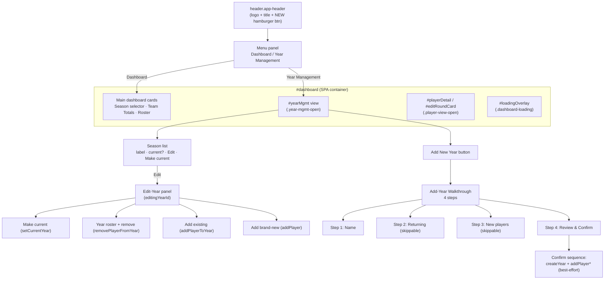
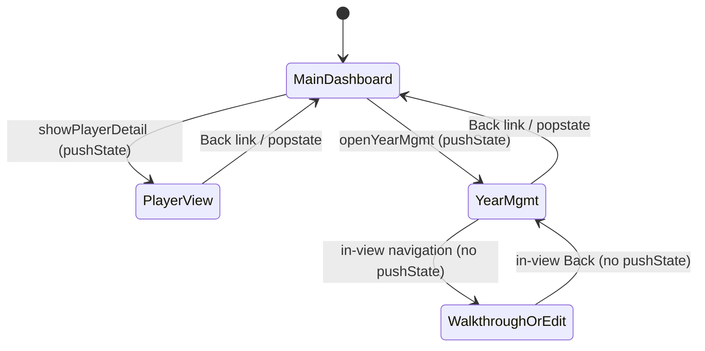

# Design Document: Admin Year Management & Navigation

## Overview

This feature restructures the Coach Admin dashboard's information architecture entirely on the frontend (`admin.html`, `assets/js/admin.js`, `assets/css/styles.css`). It replaces the inline `#settingsSection` "Settings" `<details>` disclosure with a **hamburger menu** in the header, introduces a **full-screen Year Management view** (a new SPA-within-page view-state that mirrors the existing player full-screen view), moves all season administration (create year, make current, import/add existing players, add brand-new players) out of the main dashboard and into Year Management, and turns creating a season into a **4-step walkthrough** where the coach names the season, picks returning players, types brand-new players, then reviews and confirms.

No Apps Script/backend changes are made. Every relocated control keeps working through the **existing** backend actions (`createYear`, `addPlayer`, `addPlayerToYear`, `setCurrentYear`, `removePlayerFromYear`). No new HTML page is added, and session/auth is untouched. Where feasible, DOM-free logic (walkthrough validation, confirm-summary assembly, new-player row validation, year-list view models) is factored into `assets/js/admin-logic.js` so it can be unit/property tested with the existing dependency-free Node harness — no jsdom, no puppeteer, no build step.

The dominant design challenge is **composing multiple full-screen view-states**: the existing player view (`.player-view-open`), the new year-management view (`.year-mgmt-open`), and the loading overlay (`.dashboard-loading`) must never conflict, and browser/gesture Back must stay coherent (no double-trigger, no orphaned history entries). The design solves this by mirroring — not entangling — the proven player-view pattern: a separate boolean guard, a separate open/close pair, a shared `popstate` handler, and CSS view-state rules that each name their own surviving child.

## Architecture



### View-state model

`#dashboard` is the single SPA container. Its visible content is governed by a small set of mutually-exclusive-ish CSS classes, each of which whitelists the child that survives:

| Class | Meaning | Surviving child (CSS) |
| --- | --- | --- |
| _(none)_ | Main dashboard | Season selector, Team Totals, Roster |
| `dashboard-loading` | Season data loading | `#loadingOverlay` only |
| `player-view-open` | Full-screen player view | `#playerDetail` / `#editRoundCard` |
| `year-mgmt-open` | Full-screen Year Management | `#yearMgmt` only |

**Invariant — at most one full-screen view is open at a time.** The controllers enforce this: opening Year Management first closes the player view if it is open (and vice-versa), so `player-view-open` and `year-mgmt-open` are never set simultaneously. During loading, `dashboard-loading` hides everything (including the full-screen views) behind the overlay; the JS re-applies the correct state after `refresh()` completes, exactly as the player view does today.

### History / Back model

The existing player view pushes one history entry on open (`history.pushState`) and consumes it on close (`history.back()` when closed via an on-page control; nothing when closed via `popstate`). Year Management mirrors this with its **own** guard (`yearMgmtOpen`) and its own open/close pair. A single shared `popstate` handler dispatches to whichever view is open:



In-view navigation **within** Year Management (opening Edit-Year, stepping the walkthrough) does NOT push additional history entries — it is internal state, so one browser-Back returns straight to the main dashboard. This matches how the player view treats the round editor as internal to the player view.

## Sequence Diagrams

### Opening Year Management from the hamburger menu

```mermaid
sequenceDiagram
    participant U as Coach
    participant Menu as Menu panel
    participant Ctrl as admin.js controller
    participant DOM as #dashboard

    U->>Menu: tap hamburger, choose "Year Management"
    Menu->>Ctrl: openYearMgmt()
    Ctrl->>Ctrl: if playerViewOpen -> closePlayerDetail(false)
    Ctrl->>Ctrl: yearMgmtOpen = true; capture scrollY
    Ctrl->>DOM: add class .year-mgmt-open; scrollTo(0,0)
    Ctrl->>Ctrl: history.pushState({adminYearMgmt:true})
    Ctrl->>DOM: renderYearList(data.years)
```

### Add New Year walkthrough — confirm (best-effort)

```mermaid
sequenceDiagram
    participant U as Coach
    participant Ctrl as admin.js controller
    participant Api as Api.post
    participant BE as Apps Script (unchanged)

    U->>Ctrl: Confirm (Step 4)
    Ctrl->>Api: createYear(label, returningTokens)
    Api->>BE: action createYear
    alt createYear fails
        BE-->>Ctrl: error
        Ctrl->>U: show error, STAY in walkthrough (nothing created)
    else createYear succeeds
        BE-->>Ctrl: { yearId, label }
        loop each new player {name, sex}
            Ctrl->>Api: addPlayer(name, sex, yearId)
            Api->>BE: action addPlayer
            alt addPlayer succeeds
                BE-->>Ctrl: { Token, ... }
                Ctrl->>Ctrl: record success + playerLink(Token)
            else addPlayer fails
                BE-->>Ctrl: error
                Ctrl->>Ctrl: record failure {name, sex, message}
            end
        end
        Ctrl->>Ctrl: selectedYearId = yearId; Store.writeViewingYearId(yearId)
        Ctrl->>Ctrl: await refresh()
        Ctrl->>U: success screen: created players + links; list any failures + "edit this season to retry"
    end
```

## Components and Interfaces

### Component 1: Hamburger Menu

**Purpose**: Header-level navigation entry point; replaces the removed inline Settings disclosure.

**DOM (admin.html, inside `header.app-header`)**:
- `#menuToggle` — `<button>` with an accessible label (`aria-label="Menu"`, `aria-expanded`, `aria-controls="menuPanel"`), showing a hamburger glyph.
- `#menuPanel` — a panel/list (role `menu` or a simple nav list) containing at least: **Dashboard** (`#menuDashboard`) and **Year Management** (`#menuYearMgmt`).

**Responsibilities**:
- Toggle open/closed on click; reflect state in `aria-expanded`.
- Keyboard-accessible: focusable button, Enter/Space activate, Escape closes, focus moves into the panel when opened.
- Close on outside click and after an item is chosen.
- "Dashboard" closes any open full-screen view and returns to the main dashboard; "Year Management" calls `openYearMgmt()`.

### Component 2: Year Management View (`#yearMgmt`)

**Purpose**: Full-screen view listing all seasons and hosting all season administration.

**Interface (controller functions in admin.js)**:
```javascript
function openYearMgmt()                 // enter full-screen YM view (mirrors enterPlayerView)
function closeYearMgmt(fromPopstate)    // leave YM view (mirrors closePlayerDetail)
function renderYearList()               // render season rows from data.years
function openEditYear(yearId)           // set editingYearId; render edit-year panel
function closeEditYear()                // return to the season list (in-view, no history)
```

**Sub-regions**:
- **Season list** — one row per `data.years` entry: label, a "Current" marker when `isCurrentYearRow(y)`, an **Edit** control, and a **Make current** control shown/enabled only when the row is not current.
- **Add New Year** button — launches the walkthrough.
- **Edit-Year panel** — the season admin for `editingYearId` (Component 3).
- **Walkthrough** — the 4-step create flow (Component 4).

### Component 3: Edit-Year Panel

**Purpose**: Full season administration for one explicitly-selected season.

**State**: `editingYearId` — the YearID whose Edit was clicked. This is **separate** from `selectedYearId` (which drives the main dashboard). All actions in this panel target `editingYearId`.

**Contents & backend mapping** (all existing actions):
- **Make this the current season** — `setCurrentYear(editingYearId)`; shown only when the edited year is not current.
- **Year roster** — the players rostered to `editingYearId` (`rosterPlayersForYear(editingYearId)`), each with a **Remove** control → `removePlayerFromYear(token, editingYearId)`.
- **Add Existing Player to this season** — candidates from `existingPlayerCandidates(data.players, rosterTokensForYear(editingYearId))` → `addPlayerToYear(token, editingYearId)`.
- **Add brand-new player** — the relocated Add Player form (name + Boy/Girl) → `addPlayer(name, sex, editingYearId)`, then show the generated player link in a link box to copy.

**Rename is explicitly out of scope.** The backend has no rename action; the edit-year panel does NOT rename a season. It manages roster, current-status, and players only. Adding rename would require a new backend action, which this feature does not include.

### Component 4: Add-Year Walkthrough

**Purpose**: Guided multi-step creation of a new season.

**Interface**:
```javascript
function startWalkthrough()             // reset walkthrough state, go to step 1
function walkGoTo(step)                 // navigate steps (Back/Next/skip); re-render
function walkAddNewPlayerRow()          // append a {name, sex} input row (step 3)
function walkConfirm()                  // run the confirm sequence (best-effort)
function renderWalkStep()               // render current step + progress indicator
```

**State (a single walkthrough model object)**:
```javascript
const walk = {
  step: 1,                 // 1..4
  label: '',               // step 1
  returningTokens: [],     // step 2 (subset of importCandidatesFrom output)
  newPlayers: [],          // step 3: [{ name, sex }]
  result: null             // populated after confirm: { yearId, created:[], failed:[] }
};
```

**Stepper**: Back/Next navigation with a visible progress indicator (e.g. "Step 2 of 4"). Steps 2 (returning) and 3 (new players) are skippable; both skipped yields a season with no players. Step 4 is Review & Confirm.

## Data Models

### Walkthrough new-player row
```javascript
// One row in walk.newPlayers
{
  name: string,   // trimmed; non-empty required to count as a valid row
  sex:  'Boy' | 'Girl'
}
```
**Validation rules**: A row is *valid* when `name.trim()` is non-empty and `sex` is `'Boy'` or `'Girl'`. Blank rows (empty name) are ignored on confirm, not treated as errors. At least one of {returning selected, valid new rows} is NOT required — an empty season is allowed.

### Confirm summary (assembled purely for Step 4 + confirm)
```javascript
{
  label: string,                 // trimmed label
  returning: [{ token, name }],  // selected returning players (name looked up for display)
  newPlayers: [{ name, sex }]    // valid new rows only
}
```

### Confirm result (best-effort outcome)
```javascript
{
  yearId: string,                        // from createYear result
  label: string,
  created: [{ name, sex, token, link }], // addPlayer successes (link via playerLink(token))
  failed:  [{ name, sex, message }]      // addPlayer failures, for retry-in-edit-year
}
```

### Year-list view model (pure, for rendering the season list)
```javascript
// AdminLogic.yearListRows(years, isCurrent) -> ordered rows
{ yearId, label, isCurrent, canMakeCurrent }  // canMakeCurrent === !isCurrent
```

## Pure Logic (extract into assets/js/admin-logic.js)

These helpers contain no DOM, storage, or navigation and are directly testable with the existing Node harness. They mirror the existing `resolveViewingYearId` / `importCandidatesFrom` / `existingPlayerCandidates` pattern.

```javascript
// Step-completeness / navigation gating for the walkthrough.
// Returns which steps are reachable/complete given the current model.
AdminLogic.walkStepValidation(walk)
//   -> { labelValid: boolean,         // step 1 label non-empty after trim
//        step1Complete: boolean,      // === labelValid
//        canConfirm: boolean }        // labelValid (steps 2 & 3 skippable)

// Trim + non-empty guard for a season label (mirrors createYear's trimmed-empty guard).
AdminLogic.isValidYearLabel(label) -> boolean

// Validate/normalize a single new-player row.
AdminLogic.validateNewPlayerRow(row)
//   -> { valid: boolean, name: string /*trimmed*/, sex: 'Boy'|'Girl'|null }

// Keep only valid new-player rows (drops blank rows), preserving order.
AdminLogic.collectNewPlayers(rows) -> [{ name, sex }]

// Assemble the Step-4 confirm summary from the raw model + player lookup.
AdminLogic.buildConfirmSummary(walk, players)
//   -> { label, returning:[{token,name}], newPlayers:[{name,sex}] }

// Order/annotate the season list for rendering.
AdminLogic.yearListRows(years, isCurrent)
//   -> [{ yearId, label, isCurrent, canMakeCurrent }]  // newest-first, mirrors populateYearSelect sort
```

DOM/navigation (menu toggle, view-state classes, history, rendering, `Api.post` calls) stay in `admin.js`.

## Key Functions with Formal Specifications

### openYearMgmt()
```javascript
function openYearMgmt()
```
**Preconditions**: dashboard is shown; `data` loaded.
**Postconditions**:
- If `playerViewOpen`, it is closed first (so the two view guards are never both true).
- `yearMgmtOpen === true`; `#dashboard` carries `year-mgmt-open` and not `player-view-open`.
- Exactly one history entry is pushed; window scrolled to top; season list rendered.
- Idempotent: calling when already open pushes no additional history entry (mirror of `enterPlayerView`'s `if (playerViewOpen) return` guard).

### closeYearMgmt(fromPopstate)
```javascript
function closeYearMgmt(fromPopstate)
```
**Preconditions**: none (safe to call when closed).
**Postconditions**:
- If not open, returns immediately (guards double-trigger).
- `yearMgmtOpen === false`; `year-mgmt-open` removed; main dashboard visible.
- When `fromPopstate` is false, `history.back()` consumes the pushed entry; when true, it does NOT (mirror of `closePlayerDetail`).
- Roster/main-dashboard scroll restored to the captured position.

### walkConfirm()
```javascript
async function walkConfirm()
```
**Preconditions**: `AdminLogic.walkStepValidation(walk).canConfirm === true`.
**Postconditions**:
- Calls `createYear(walk.label, walk.returningTokens)` exactly once.
- If `createYear` rejects: nothing created; error surfaced; walkthrough stays open (no year, no players).
- If `createYear` resolves `{ yearId }`: for each row in `AdminLogic.collectNewPlayers(walk.newPlayers)`, calls `addPlayer(name, sex, yearId)`; successes and failures are partitioned into `result.created` / `result.failed`. The created year and all successful players are KEPT regardless of any failures (no rollback).
- On success/partial: `selectedYearId = yearId`; `Store.writeViewingYearId(yearId)`; `await refresh()`; success screen lists created players + links and any failures with guidance to retry via edit-year.

## Algorithmic Pseudocode

### Walkthrough confirm (best-effort partial-failure)
```pascal
ALGORITHM walkConfirm(walk)
INPUT: walk (label, returningTokens, newPlayers)
OUTPUT: result (yearId, created[], failed[]) OR walkthrough stays open

BEGIN
  ASSERT AdminLogic.walkStepValidation(walk).canConfirm = true

  TRY
    yearRes <- Api.post(createYear, walk.label, walk.returningTokens)
  CATCH err
    DISPLAY error(err.message)
    RETURN   // nothing created; stay in walkthrough
  END TRY

  created <- []
  failed  <- []
  newRows <- AdminLogic.collectNewPlayers(walk.newPlayers)  // drops blank rows

  FOR each row IN newRows DO
    TRY
      rec <- Api.post(addPlayer, row.name, row.sex, yearRes.yearId)
      created.add({ name: row.name, sex: row.sex, token: rec.Token, link: playerLink(rec.Token) })
    CATCH err
      failed.add({ name: row.name, sex: row.sex, message: err.message })  // KEEP going; no rollback
    END TRY
  END FOR

  selectedYearId <- yearRes.yearId
  Store.writeViewingYearId(yearRes.yearId)
  AWAIT refresh()

  ASSERT yearRes.yearId is present in data.years   // year kept even on partial failure
  DISPLAY successScreen(created, failed)           // failures -> "edit this season to retry"
  RETURN { yearId: yearRes.yearId, created, failed }
END
```
**Preconditions**: `canConfirm` true (label valid; steps 2/3 skippable).
**Postconditions**: `createYear` called once; on its failure nothing is created; on its success the year plus successful players persist even if some `addPlayer` calls fail; data refreshed and new season selected/persisted.
**Loop invariants**: after processing each row, `created` and `failed` are disjoint and together account for every row processed so far; a failure never removes an already-created player or the year.

### Open a full-screen view (mirrors enterPlayerView)
```pascal
ALGORITHM openFullScreenView(viewClass, openFlag, otherCloseFn)
BEGIN
  IF openFlag THEN RETURN                    // idempotent: no duplicate history
  IF otherViewOpen THEN otherCloseFn(false)  // enforce single-open invariant
  savedScrollY <- window.scrollY
  dashboard.addClass(viewClass)
  openFlag <- true
  window.scrollTo(0, 0)
  history.pushState({ marker: true }, '', location.href)
END
```
**Loop invariants**: N/A (no loops).

## Example Usage

```javascript
// Hamburger -> Year Management
menuYearMgmt.addEventListener('click', () => { closeMenu(); openYearMgmt(); });

// Season list row -> edit a SPECIFIC year (not selectedYearId)
onEditClick = (yearId) => openEditYear(yearId);   // sets editingYearId

// Edit-year: add a brand-new player to the edited season
addPlayer(name, sex, editingYearId).then(rec => showLink(playerLink(rec.Token)));

// Walkthrough confirm keeps a partially-created season
await walkConfirm();  // year kept; failed addPlayers listed for retry in edit-year

// Shared popstate dispatch
window.addEventListener('popstate', () => {
  if (playerViewOpen) return closePlayerDetail(true);
  if (yearMgmtOpen)   return closeYearMgmt(true);
});
```

## Correctness Properties

*A property is a characteristic that should hold true across all valid executions of the system. Properties bridge human-readable specifications and machine-verifiable guarantees.*

All properties below are over the extracted, DOM-free `AdminLogic` helpers, so they run in the existing Node harness at ≥100 iterations each. Navigation, history, view-state composition, and backend wiring are not universally-quantifiable pure properties — they are covered by static analysis and the documented manual procedure (see Testing Strategy), so they are intentionally not listed here.

### Property 1: Season list is complete and newest-first

For any array of season rows, `AdminLogic.yearListRows(years, isCurrent)` returns exactly one row per input season (same count, every YearID present exactly once) ordered newest-first by `CreatedAt`.

**Validates: Requirements 4.1, 4.2**

### Property 2: Make-current visibility is exactly the non-current seasons

For any array of season rows and any `isCurrent` predicate, every row produced by `AdminLogic.yearListRows` satisfies `row.isCurrent === isCurrent(matchingYear)` and `row.canMakeCurrent === !row.isCurrent`.

**Validates: Requirements 4.2, 4.4, 4.5, 5.3**

### Property 3: Label validity ignores surrounding whitespace

For any string, `AdminLogic.isValidYearLabel(label)` returns false if and only if the string is empty after trimming, and true for any string with at least one non-whitespace character.

**Validates: Requirements 6.3**

### Property 4: Confirm is gated only by the label (steps 2 and 3 are skippable)

For any walkthrough model, `AdminLogic.walkStepValidation(walk).canConfirm === AdminLogic.isValidYearLabel(walk.label)` regardless of how many returning players or new-player rows are selected — so an otherwise-empty season with a valid label can be confirmed, and no label blocks confirmation.

**Validates: Requirements 6.3, 6.5, 6.7, 6.8**

### Property 5: New-player collection drops blank rows and preserves order

For any list of new-player rows, `AdminLogic.collectNewPlayers(rows)` contains no row whose name is empty after trimming, keeps every valid row's trimmed name and Boy/Girl sex, and preserves the relative order of the valid rows.

**Validates: Requirements 6.10**

### Property 6: Confirm summary reflects the model faithfully

For any walkthrough model and player list, `AdminLogic.buildConfirmSummary(walk, players)` yields a summary whose label equals the trimmed label, whose returning list corresponds exactly to the selected returning tokens (with names resolved from `players`), and whose newPlayers equal `AdminLogic.collectNewPlayers(walk.newPlayers)`.

**Validates: Requirements 6.9**

### Reused property (existing helper)

Add-Existing-Player candidate exclusion (Requirement 5.6) is already covered by the existing `AdminLogic.existingPlayerCandidates` property (no rostered player is ever returned): here it is invoked with `rosterTokensForYear(editingYearId)`. No new property is added; the existing test is reused.

## Error Handling

### createYear fails
**Condition**: `Api.post(createYear, ...)` rejects (e.g. duplicate label, network).
**Response**: surface the error message on the walkthrough confirm step; create nothing.
**Recovery**: user edits the label / retries Confirm; no cleanup needed (nothing was created).

### Some addPlayer calls fail after createYear succeeds
**Condition**: year created, one or more `addPlayer` calls reject.
**Response**: keep the year and the successful players; show a summary listing successes (with links) and failures (with names/messages).
**Recovery**: user opens Year Management → Edit for that season and re-adds the failed players via the edit-year Add-brand-new-player control. No rollback.

### Empty/whitespace season label
**Condition**: label is blank/whitespace at Step 1 or Confirm.
**Response**: `AdminLogic.isValidYearLabel` returns false; Next/Confirm gated; inline guidance shown (mirrors today's create-year guard).

### Storage unavailable
**Condition**: `localStorage` blocked (private mode/quota).
**Response**: unchanged from today — `Store` no-ops on failure; selection degrades gracefully. No new behavior.

### Two full-screen views requested
**Condition**: opening Year Management while player view is open (or vice-versa).
**Response**: the opening controller closes the other view first; the single-open invariant holds.

## Testing Strategy

**Constraints**: No build step; browser IIFEs; dependency-free Node harness (`admin-logic.test.js`, `roster-preservation.test.js`) with NO DOM/jsdom/browser runner. Do NOT add jsdom or puppeteer.

### Unit / Property Testing (Node, no DOM)
Extracted `AdminLogic` helpers are covered by unit and property tests in the existing harness style:
- `isValidYearLabel`, `walkStepValidation` — label trimming, step gating, `canConfirm`.
- `validateNewPlayerRow`, `collectNewPlayers` — blank-row dropping, sex normalization, order preservation.
- `buildConfirmSummary` — summary equals selected returning + valid new rows; idempotent.
- `yearListRows` — ordering (newest-first) and `canMakeCurrent === !isCurrent` for all rows.
- Property tests run ≥100 iterations, tagged `Feature: admin-year-management-nav, Property N: ...`.

### Static analysis + documented manual verification
Navigation, layout, menu behavior, view-state composition, history/Back, and walkthrough DOM flow are verified by:
- **Static analysis** of `admin.js`/`admin.html`/`styles.css` (guards present, single-open invariant enforced, view-state CSS rules whitelist the right child, no duplicate `pushState`).
- A **documented manual verification procedure** exercised at **~390px** (mobile) and **desktop**, covering: hamburger open/close + keyboard/Escape/outside-click; enter/exit Year Management via menu, on-page Back, and browser Back; single-open invariant (player view ↔ year management); edit-year actions against `editingYearId` (not `selectedYearId`); the 4-step walkthrough incl. skipping steps 2 & 3; confirm success and simulated partial failure; and that all relocated controls still work via the same backend actions.

### Preserved behavior (regression)
Player full-screen view, roster, team totals, rounds editing, mobile responsiveness, and the loading overlay must remain unchanged; the manual procedure includes a regression pass over these.

## Performance Considerations

Frontend-only, in-memory rendering over already-loaded `data`. The walkthrough's confirm issues one `createYear` call plus up to N `addPlayer` calls (N = number of new players typed), which is inherent to the task. No new network patterns beyond the existing per-action `Api.post`.

## Security Considerations

No auth/session change. All mutations continue to require the existing admin session and go through the same backend actions with the same server-side validation. No new client-trusted paths.

## Dependencies

- Existing backend actions (READ-ONLY, unchanged): `createYear(label, playerTokens) -> { yearId, label }`, `addPlayer(name, sex, yearId) -> { Token, ... }`, `addPlayerToYear(token, yearId)`, `setCurrentYear(yearId)`, `removePlayerFromYear(token, yearId)`.
- Existing pure helpers reused: `isCurrentYearRow`, `resolveViewingYearId`, `existingPlayerCandidates`, `importCandidatesFrom`.
- Existing frontend infra: `Api.post`, `UI.withBusy`, `Store`, `playerLink`, `escapeHtml`, `:root` brand vars, `.card`, the 640px media query, and the `.player-view-open` / `.dashboard-loading` view-state conventions.
