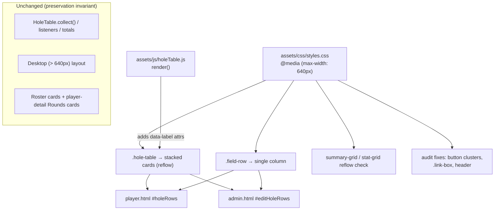

# Design Document: Mobile Responsive Pass

## Overview

The golf-scores site renders forms and tables with desktop-first layouts. Two prior specs added mobile card layouts for the admin Roster and the admin player-detail Rounds list, but the rest of the site — the round forms, the summary grids, and especially the shared 7-column hole-by-hole entry table — is still cramped or overflows on phones. This pass makes adding, editing, and viewing rounds render well at phone widths (~390px) on both the admin dashboard (`admin.html`) and the public player page (`player.html`).

The approach is almost entirely CSS, layered into the existing `@media (max-width: 640px)` breakpoint in `assets/css/styles.css` — the same breakpoint the already-shipped roster/rounds cards use. The one non-CSS change is a behavior-neutral markup addition in the shared `assets/js/holeTable.js` renderer: each `<td>` gains a `data-label` attribute so CSS can surface the column label on mobile after the `<thead>` is hidden. No inputs, classes, values, listeners, or `collect()` selectors change, so `HoleTable.collect()`, `attachParListeners`, `syncFairwayVisibility`, `applyCoursePars`, and `updateRunningTotal` all keep working unchanged.

The central design tension is the hole table. It is a real `<table>` shared by the player entry form (`#holeRows`) and the admin editor (`#editHoleRows`), and all the JS logic reads/writes it as a table. Rather than build a parallel JS card renderer (which would duplicate logic and risk divergence), the design keeps the identical table markup and uses **CSS-only reflow** to make each `<tr>` present as a stacked per-hole card at ≤640px. This preserves every existing behavior while fixing the mobile layout.

## Architecture

The system is static HTML + vanilla JS IIFEs with a single shared stylesheet. There is no build step. Responsiveness is achieved entirely through the cascade: a single mobile breakpoint restyles existing DOM, and the shared table renderer adds label metadata that only CSS consumes.



### Layering into the existing breakpoint

All new rules go inside the existing `@media (max-width: 640px)` block (currently around line 577 of `styles.css`), joining the roster and rounds-card rules already there. Desktop rules (> 640px) are never modified, which structurally guarantees the desktop layout and all existing behavior stay unchanged.

### Scoping discipline

Global element rules (`.field-row`, `input`, `select`) are safe to change globally because that is the intended cross-page effect. Table-specific rules MUST be scoped to `.hole-table` so the reflow does not touch the roster table, the admin player-detail Rounds table, the public Recent Rounds table, or any other `.table-scroll` consumer. This mirrors the scoping discipline already established for `#rosterTable .table-scroll` and `#playerDetailRounds > table`.

## Components and Interfaces

### Component 1: `.field-row` global collapse

**Purpose**: Paired inputs currently sit in a fixed `1fr 1fr` grid that never collapses, so on phones each control is roughly half a ~390px screen minus gap — too narrow for dates, course/tee names, tee/rating/slope triples, and the admin create-season / add-existing / add-player rows.

**Interface** (CSS contract):
```css
/* Desktop (unchanged, outside the media query) */
.field-row { display: grid; grid-template-columns: 1fr 1fr; gap: 0.75rem; }

/* Inside @media (max-width: 640px) */
.field-row { grid-template-columns: 1fr; }
```

**Responsibilities**:
- At ≤640px, stack every `.field-row` child into a single full-width column.
- Affect all `.field-row` instances on both pages (this is the intended global change).
- Leave `align-items:end` / `align-items:start` inline styles harmless (in a single column they no longer matter).

**Notes**: The admin `#addPlayerForm` is itself a `.field-row` (name / sex / button), so it collapses too, giving full-width controls and a full-width submit button on mobile.

### Component 2: `.hole-table` CSS reflow to per-hole cards

**Purpose**: The 7-column hole table (Hole, Par, Score, Fairway, GIR, Putts, Penalty) with fixed `4.5em` inputs is the biggest offender — it overflows and requires horizontal scrolling inside `.table-scroll`.

**Interface** (CSS contract, all scoped under `.hole-table` and inside the breakpoint):
```css
@media (max-width: 640px) {
  /* Neutralize table semantics so rows/cells stack */
  .hole-table, .hole-table tbody, .hole-table tr, .hole-table td { display: block; width: 100%; }

  /* Hide the header row entirely; labels come from data-label instead */
  .hole-table thead { display: none; }

  /* Each row becomes a bordered card reusing the brand system */
  .hole-table tr {
    background: var(--card);
    border: 1px solid var(--border);
    border-radius: var(--radius);
    padding: 0.6rem 0.75rem;
    margin-bottom: 0.6rem;
  }

  /* Each cell becomes a labeled row: label left (::before), input right */
  .hole-table td {
    display: flex;
    align-items: center;
    justify-content: space-between;
    gap: 0.75rem;
    padding: 0.3rem 0;
    border-bottom: 1px solid var(--border);
    white-space: normal;              /* override th,td { white-space:nowrap } */
  }
  .hole-table td:last-child { border-bottom: none; }
  .hole-table td::before {
    content: attr(data-label);
    color: var(--muted);
    text-transform: uppercase;
    letter-spacing: 0.03em;
    font-size: 0.68rem;
    font-weight: 600;
  }

  /* Hole-number cell as a card heading, not a labeled row */
  .hole-table td.hole-num {
    justify-content: flex-start;
    font-family: var(--font-heading);
    font-weight: 700;
    color: var(--navy);
    border-bottom: 1px solid var(--border);
    padding-bottom: 0.4rem;
    margin-bottom: 0.2rem;
  }
  .hole-table td.hole-num::before { content: attr(data-label); margin-right: 0.4rem; }

  /* Comfortable tap targets: inputs grow instead of fixed 4.5em.
     The inline style="width:4.5em" on inputs is overridden here. */
  .hole-table input,
  .hole-table select {
    width: auto;
    flex: 0 0 auto;
    min-width: 5.5em;
    min-height: 40px;
    padding: 0.45rem;
    font-size: 1rem;
  }
  .hole-table select { min-width: 7em; }
}
```

**Responsibilities**:
- Present each hole as a bordered card with the hole number as a heading and one labeled line per field.
- Keep the Par-3 fairway behavior intact: `syncFairwayVisibility` still toggles `.fairway` `display:none` and shows `.fairway-na` ("—"); the CSS row for that cell shows the label with the "—" on the right.
- Provide ≥40px tall, easily tappable inputs/selects instead of the 4.5em desktop width.
- Keep `#runningTotal` / `#editRunningTotal` visible (they live outside the table, in a `<p>`, so no change needed).

**Overflow note**: `.table-scroll { overflow-x: auto }` wraps the hole table. Once reflowed to full-width blocks there is no content wider than the viewport, so no scrollbar appears. No change to `.table-scroll` is required for the hole table, and because the reflow is scoped to `.hole-table`, other `.table-scroll` tables keep their horizontal scroll.

### Component 3: `HoleTable.render()` `data-label` markup addition

**Purpose**: With `<thead>` hidden on mobile, each field needs its label to come from somewhere. A `data-label` attribute on each `<td>` lets CSS `::before { content: attr(data-label); }` render it.

**Interface** (the ONLY JS change; illustrative, current classes/inputs unchanged):
```javascript
// Inside render(), each <td> gains a data-label; the hole cell also gets a class.
`<tr data-hole="${h}">
  <td class="hole-num" data-label="Hole">${h}</td>
  <td data-label="Par"><input type="number" class="par" ... style="width:4.5em"></td>
  <td data-label="Score"><input type="number" class="score" ... style="width:4.5em"></td>
  <td data-label="Fairway"> ...existing .fairway select + .fairway-na span... </td>
  <td data-label="GIR"> ...existing .gir select... </td>
  <td data-label="Putts"><input type="number" class="putts" ... style="width:4.5em"></td>
  <td data-label="Penalty"><input type="number" class="penalty" ... style="width:4.5em"></td>
</tr>`
```

**Responsibilities**:
- Add `data-label` to all seven `<td>`s and a `hole-num` class to the hole-number cell.
- Change NOTHING else: input classes (`.par`, `.score`, `.fairway`, `.fairway-na`, `.gir`, `.putts`, `.penalty`), values, the inline `width:4.5em`, `required`/`disabled` attributes, the Par-3 branch, and all event wiring stay byte-for-byte equivalent in behavior.
- Because `collect()` selects by class and `data-*` attributes are inert to those selectors and to form submission, this is behavior-neutral.

### Component 4: Grid reflow verification (`.summary-grid`, `.stat-grid`)

**Purpose**: `.summary-grid` uses `repeat(auto-fit, minmax(140px, 1fr))` and `.stat-grid` uses `minmax(110px, 1fr)`. Auto-fit already reflows, but at 390px a 140px minimum can leave awkward gaps or, with padding, crowd.

**Interface** (contingent CSS, only if needed):
```css
@media (max-width: 640px) {
  /* Apply ONLY if 140px min causes overflow/cramping at 390px during verification */
  .summary-grid { grid-template-columns: repeat(auto-fit, minmax(120px, 1fr)); }
}
```

**Responsibilities**:
- Verify both grids reflow acceptably at 390px.
- Reduce the `.summary-grid` min to ~120px at the breakpoint only if verification shows overflow/cramping; otherwise leave unchanged. `.stat-grid` at 110px is expected to be fine and left alone unless verification shows otherwise.

### Component 5: Per-page audit fixes (button clusters, `.link-box`, header)

**Purpose**: Several right-aligned button clusters and fixed-min-width elements crowd or overflow at 390px.

**Interfaces** (CSS contract, inside the breakpoint):
```css
@media (max-width: 640px) {
  /* Right-aligned button clusters in player detail (Remove/Delete pair,
     Edit/Save/Cancel sex controls, Add Round). Target the inline
     `text-align:right` action wrappers and the sex link-box buttons so they
     wrap / go full-width instead of overflowing. */
  #playerDetail .field-row > div[style*="text-align:right"] { text-align: left; }
  #playerDetail .field-row > div[style*="text-align:right"] button { width: 100%; margin-top: 0.4rem; }

  /* .link-box input has min-width:200px which forces overflow at ~390px when
     sitting beside a Copy button. Let it shrink and let the button be full-width. */
  .link-box input { min-width: 0; }
  .link-box button { flex: 1 1 auto; min-height: 40px; }

  /* Header: allow logo + title to stay comfortable; title can shrink slightly. */
  header.app-header { padding: 0.85rem 1rem; }
  header.app-header h1 { font-size: 1.1rem; }
}
```

**Responsibilities**:
- Ensure the player-detail Remove-from-Season / Delete-Player pair, the Edit/Save/Cancel sex controls, and the Add Round button wrap or go full-width rather than crowding/overflowing at 390px.
- Let `.link-box` inputs shrink below 200px so the input + Copy button fit; give the Copy button a comfortable tap target.
- Keep the header logo + title readable without overflow.
- Only touch HTML if a structural change is unavoidable; prefer attribute/inline-style-targeting CSS selectors as above. If a selector proves too brittle, the fallback is a minimal HTML change adding a class (e.g. `class="detail-actions"`) to the wrapper — documented, not assumed.

### Component 6: Public Recent Rounds table (`#recentRounds`) — audit decision

**Purpose**: `player.js` renders `#recentRounds` as a 5-column table (Date+badges, Course, Holes, Score, Differential) inside a `.table-scroll` wrapper.

**Decision (documented)**: Leave `#recentRounds` as a horizontally scrollable table. It is only 5 columns of mostly short values and is materially narrower than the 7-column hole table; the existing `.table-scroll { overflow-x: auto }` wrapper already handles any minor overflow gracefully. Building a card layout would require a new JS renderer and a card-class contract with no confirmed need, which is out of the minimal scope. This matches the "prefer CSS, only touch what's needed" constraint. No change is made to `#recentRounds`; it is covered by the manual verification checklist to confirm the scroll behavior is acceptable at 390px.

## Data Models

No data models change. For reference, the hole-table cell/label mapping the CSS depends on:

| `<td>` position | `data-label` | Contents | Class |
| --- | --- | --- | --- |
| 1 | `Hole` | hole number text | `hole-num` |
| 2 | `Par` | `input.par` (may be `disabled`) | — |
| 3 | `Score` | `input.score` (`required`) | — |
| 4 | `Fairway` | `select.fairway` + `span.fairway-na` | — |
| 5 | `GIR` | `select.gir` | — |
| 6 | `Putts` | `input.putts` | — |
| 7 | `Penalty` | `input.penalty` | — |

**Validation Rules**:
- `data-label` values are static strings; they never feed logic and are ignored by `collect()`.
- The `hole-num` class and `data-label` attributes are the complete set of markup additions; no other attribute is added or removed.

## Error Handling

This is a presentation-layer change with no new runtime code paths.

### Scenario 1: A `.table-scroll` other than the hole table is accidentally reflowed
**Condition**: An unscoped table rule matches the roster / player-detail Rounds / Recent Rounds tables.
**Response**: Prevented by scoping every reflow rule under `.hole-table`. Verified by static inspection of every new selector.
**Recovery**: If observed, tighten the selector to `.hole-table`.

### Scenario 2: `white-space: nowrap` from the global `th, td` rule prevents wrapping in cards
**Condition**: Labeled cell values (e.g. long select text) don't wrap.
**Response**: The reflow explicitly sets `white-space: normal` on `.hole-table td` inside the breakpoint.
**Recovery**: Confirmed during verification at 390px.

### Scenario 3: Par-3 hidden fairway leaves an empty labeled row
**Condition**: On a Par-3, `.fairway` is `display:none` and `.fairway-na` ("—") is shown; the cell should still read cleanly.
**Response**: The `Fairway` `<td>` still renders its label with the "—" span on the right, so the row reads "Fairway  —". No layout break.
**Recovery**: Verified in the manual checklist (enter a Par-3 hole on mobile).

## Testing Strategy

There is no build step, browser code runs as IIFEs, and the Node test harness (`assets/js/admin-logic.test.js`, `assets/js/roster-preservation.test.js`) is dependency-free with **no DOM/jsdom/browser runner**. The change is CSS plus behavior-neutral `data-label` markup, so verification is primarily static analysis plus a documented manual procedure. No jsdom or puppeteer is introduced.

### Unit Testing Approach
- The existing Node suites MUST continue to pass unchanged, confirming no logic was touched. Run whatever the repo uses to execute the `*.test.js` files (e.g. `node assets/js/admin-logic.test.js`).
- `HoleTable.render()` builds an HTML string. If the Node harness can invoke `render()` against a minimal stub `tbody` (an object exposing a settable `innerHTML` and no-op `querySelectorAll` for the post-render sync calls), a lightweight assertion that the produced string contains `data-label="Par"`, `data-label="Score"`, …, `class="hole-num"`, and still contains the unchanged input classes (`class="par"`, `class="score"`, etc.) is feasible and would guard the markup contract. This is optional and only if it fits the existing dependency-free harness style; do NOT add a DOM library to enable it.

### Property-Based Testing Approach
Not applicable. This is CSS reflow + static markup — there is no pure function whose behavior varies meaningfully across generated inputs, so PBT is the wrong tool (per the PBT-applicability guidance). Accordingly, this design has **no Correctness Properties section** and tasks include no property-test sub-tasks. The one arguably-testable invariant (render output preserves input classes while adding labels) is covered by the optional unit assertion above.

### Manual Verification Approach (primary)
Documented procedure performed at **~390px** (phone-first) and a **~768px** small-tablet sanity check, on **both** pages, using browser devtools device emulation:

Player page (`player.html`, via a valid player token URL):
1. Load the page; confirm header logo + title render without overflow.
2. Enter a Round → hole-by-hole: confirm each hole shows as a stacked card with labeled Par/Score/Fairway/GIR/Putts/Penalty rows and a Hole heading; inputs are tappable (≥40px) and not clipped; no horizontal scrollbar on the hole section.
3. Enter a Par-3 par value on a hole; confirm the Fairway row shows "—" and the select is hidden, and the running Total updates.
4. Switch to "Just the totals"; confirm the summary grids reflow cleanly (no overflow/cramping at 390px).
5. Confirm the Recent Rounds table scrolls acceptably.
6. Submit a round; confirm it still saves (behavior unchanged).

Admin page (`admin.html`, logged in):
7. Confirm Add Player form controls and submit button are full-width and usable; `.link-box` (generated link + Copy) fits without overflow.
8. Open a player; confirm Remove-from-Season / Delete-Player and the Edit/Save/Cancel sex controls wrap / go full-width and don't overflow; the detail `.link-box` fits.
9. Edit a round → hole-by-hole: same card checks as steps 2–3 on `#editHoleRows`; confirm prefilled values appear and Save works.
10. Confirm the already-done Roster cards and player-detail Rounds cards are unaffected.

Desktop regression (> 640px):
11. Confirm all forms, the hole table (as a real table), summary/stat grids, button clusters, and header are visually unchanged from before this pass.

### Preservation Invariant (must hold)
- Desktop (> 640px) layout is unchanged.
- `HoleTable.collect()`, `attachParListeners`, `syncFairwayVisibility`, `applyCoursePars`, `updateRunningTotal`, and form submit behave identically.
- The already-shipped admin Roster cards and admin player-detail Rounds cards are untouched.
- Existing Node test suites still pass.

## Dependencies

- No new dependencies. Uses only existing brand CSS variables (`--card`, `--border`, `--radius`, `--muted`, `--navy`, `--font-heading`) and the existing single stylesheet and shared `holeTable.js`.
